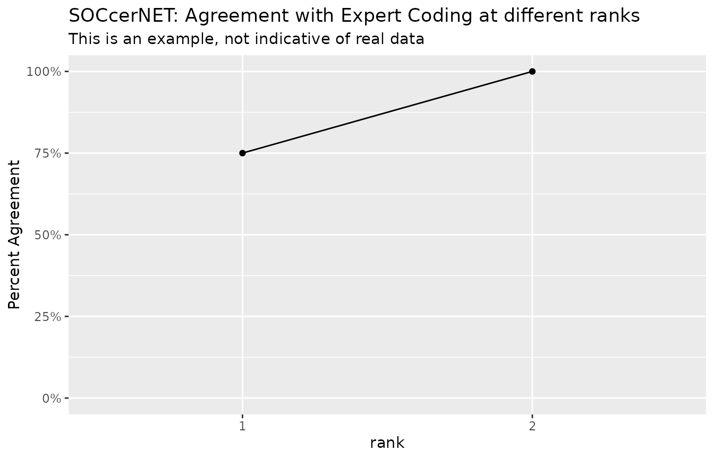

# Built on tidyverse

Occupational data is often nice and tabular, but sometimes you have data
that is not so nice. If we have soccer results, we may only want to look
at the top 3, and we may have 3 human coder results. Instead of using
having columns soc2010_1,score_1,soc2010_2,score_2… soc2010_n,score_n
you may want to simply using List columns. This is supported by
data.frame and tibble. This allows us to put vectors as values. One
drawback is the you need to map when you mutate instead of having a
simple function.

If your are using socR, codingsystem and xwalks are built on top of
tibbles. I implemented some of the dplyr verbs on codingsystems and
crosswalk, but if a verb does not exist you can get the underlying
tibble using as_tibble().

Lets make some fake data

``` r

library(socR)
library(dplyr)
library(purrr)
library(ggplot2)
```

``` r

results <- tibble(id=c("job-1","job-2","job-3","job-4"),
                  JobTitle=c("tv repairman","home plumber","fire fighter","President"),
                  JobTask =c("fix tvs","various plumbing work","put out fires, EMS","owns and operates"),
                  soc2010_1 = c("49-2097","47-2152","33-2011","11-1021"),
                  soc2010_2 = c("49-9099","47-3015","33-1021","11-1011"),
                  soc2010_3 = c("49-9031","49-9071","55-3019","11-9021"),
                  score_1 = c(0.9199,0.9866,0.9903,0.8812),
                  score_2 = c(0.0888,0.1003,0.0132,0.7980),
                  score_3 = c(0.0159,0.0337,0.0113,0.2286) )
results
#> # A tibble: 4 × 9
#>   id    JobTitle   JobTask soc2010_1 soc2010_2 soc2010_3 score_1 score_2 score_3
#>   <chr> <chr>      <chr>   <chr>     <chr>     <chr>       <dbl>   <dbl>   <dbl>
#> 1 job-1 tv repair… fix tvs 49-2097   49-9099   49-9031     0.920  0.0888  0.0159
#> 2 job-2 home plum… variou… 47-2152   47-3015   49-9071     0.987  0.100   0.0337
#> 3 job-3 fire figh… put ou… 33-2011   33-1021   55-3019     0.990  0.0132  0.0113
#> 4 job-4 President  owns a… 11-1021   11-1011   11-9021     0.881  0.798   0.229
```

Let combine the soccer results and the soccer scores.

``` r

results <- results |> 
  mutate(soc2010_soccer=pmap(pick(starts_with("soc2010_")),\(...) c(...) ),
         scores_soccer =pmap(pick(starts_with("score_")),\(...) c(...) )
        ) |>
  select(id:JobTask,soc2010_soccer,scores_soccer)

results
#> # A tibble: 4 × 5
#>   id    JobTitle     JobTask               soc2010_soccer scores_soccer
#>   <chr> <chr>        <chr>                 <list>         <list>       
#> 1 job-1 tv repairman fix tvs               <chr [3]>      <dbl [3]>    
#> 2 job-2 home plumber various plumbing work <chr [3]>      <dbl [3]>    
#> 3 job-3 fire fighter put out fires, EMS    <chr [3]>      <dbl [3]>    
#> 4 job-4 President    owns and operates     <chr [3]>      <dbl [3]>
```

Now lets make some fake human coder results

``` r

coder <- tibble(id=c("job-1","job-2","job-3","job-4"),
                JobTitle=c("tv repairman","home plumber","fire fighter","President"),
                JobTask =c("fix tvs","various plumbing work","put out fires, EMS","owns and operates"),
                soc2010_1 = c("49-2097","47-2152","33-2011","11-1011"),
                soc2010_2 = c("","46-130",NA,NA),
                soc2010_3 = c(NA,NA,NA,NA) )
coder
#> # A tibble: 4 × 6
#>   id    JobTitle     JobTask               soc2010_1 soc2010_2 soc2010_3
#>   <chr> <chr>        <chr>                 <chr>     <chr>     <lgl>    
#> 1 job-1 tv repairman fix tvs               49-2097   ""        NA       
#> 2 job-2 home plumber various plumbing work 47-2152   "46-130"  NA       
#> 3 job-3 fire fighter put out fires, EMS    33-2011    NA       NA       
#> 4 job-4 President    owns and operates     11-1011    NA       NA
```

Lets make sure that the human coder gave real codes. The socR package
comes with a predefined function is_valid_6digit_soc2010, let’s not use
it but reinvent it. We will use the soc2010 coding system that comes
with socR

``` r

is_valid_6digit_soc2010 <- valid_code( filter(soc2010_all,Level==6) )
coder |> mutate( across(c(starts_with("soc2010_")),is_valid_6digit_soc2010))
#> # A tibble: 4 × 6
#>   id    JobTitle     JobTask               soc2010_1 soc2010_2 soc2010_3
#>   <chr> <chr>        <chr>                 <lgl>     <lgl>     <lgl>    
#> 1 job-1 tv repairman fix tvs               TRUE      FALSE     FALSE    
#> 2 job-2 home plumber various plumbing work TRUE      FALSE     FALSE    
#> 3 job-3 fire fighter put out fires, EMS    TRUE      FALSE     FALSE    
#> 4 job-4 President    owns and operates     TRUE      FALSE     FALSE
```

Lets combine all the results so that the codes are valid

``` r

coder <- coder |> mutate(
  soc2010_coder= pmap( pick(starts_with("soc2010_")),\(...){
    codes = c(...)
    codes = codes[is_valid_6digit_soc2010(codes)]
  } ) ) |>
  select(id,soc2010_coder)
```

Now we can join the soccer results and the coder results.

``` r

combined_results <- left_join(results,coder,by="id")
combined_results 
#> # A tibble: 4 × 6
#>   id    JobTitle     JobTask          soc2010_soccer scores_soccer soc2010_coder
#>   <chr> <chr>        <chr>            <list>         <list>        <list>       
#> 1 job-1 tv repairman fix tvs          <chr [3]>      <dbl [3]>     <chr [1]>    
#> 2 job-2 home plumber various plumbin… <chr [3]>      <dbl [3]>     <chr [1]>    
#> 3 job-3 fire fighter put out fires, … <chr [3]>      <dbl [3]>     <chr [1]>    
#> 4 job-4 President    owns and operat… <chr [3]>      <dbl [3]>     <chr [1]>
```

Lets see how soccer did with these jobs. Since there are 3 SOCcer
results the rank can be 1,2,3,or 4+. Let’s make this an ordered factor
with levels “1”,“2”,“3”,“4+”

``` r

factor_levels <- 1:4
factor_labels <- c(1:3,"4+")
dta <- combined_results |> 
  mutate(rank= map2_int(soc2010_coder,soc2010_soccer,\(x,y)min(match(x,y)) ),
         rank=ordered(rank,factor_levels,factor_labels))
dta
#> # A tibble: 4 × 7
#>   id    JobTitle     JobTask    soc2010_soccer scores_soccer soc2010_coder rank 
#>   <chr> <chr>        <chr>      <list>         <list>        <list>        <ord>
#> 1 job-1 tv repairman fix tvs    <chr [3]>      <dbl [3]>     <chr [1]>     1    
#> 2 job-2 home plumber various p… <chr [3]>      <dbl [3]>     <chr [1]>     1    
#> 3 job-3 fire fighter put out f… <chr [3]>      <dbl [3]>     <chr [1]>     1    
#> 4 job-4 President    owns and … <chr [3]>      <dbl [3]>     <chr [1]>     2
dta |>  group_by(rank) |> summarise(n=n()) |> mutate(pct=cumsum(n)/sum(n) ) |>
  ggplot(aes(x=rank,y=pct,group = 1)) + geom_point() + 
  geom_line()+
  scale_y_continuous("Percent Agreement",limits = c(0,1),labels = scales::percent) +
  labs(title="SOCcerNET: Agreement with Expert Coding at different ranks",
       subtitle = "This is an example, not indicative of real data")
```



By default SOCcer returns the top-10 scoring codes, in this example only
3 are given and for the 4 jobs all are successfully coded by soc2010_1
or soc2010_2 (rank=1 or rank=2). From this small and very easy to code
set of jobs, you can see that SOCcer agreed with the experts 75% at the
most detailed level and 100 of the jobs agreed if you include two codes
(Do not expect results this good.).  
There is no point in continuing the line beyond 2.

I hope you see how we can use the list columns and the purrr::map family
to handle the case of multiple results. If you do not like map, you may
be able to use
[`dplyr::rowwise`](https://dplyr.tidyverse.org/reference/rowwise.html)
to handle the lists.

When you are ready to write out the data, you probably don’t want to use
csv format. I suggest using
[`jsonlite::write_json`](https://jeroen.r-universe.dev/jsonlite/reference/read_json.html)
or if you are adventurous use `arrow::write_feather`
